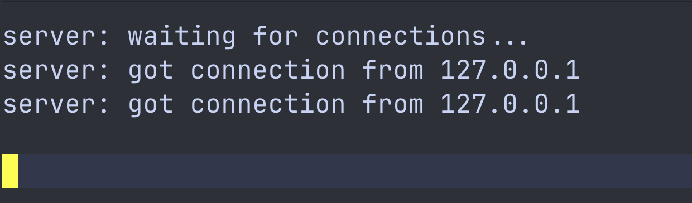
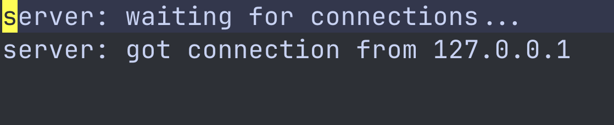
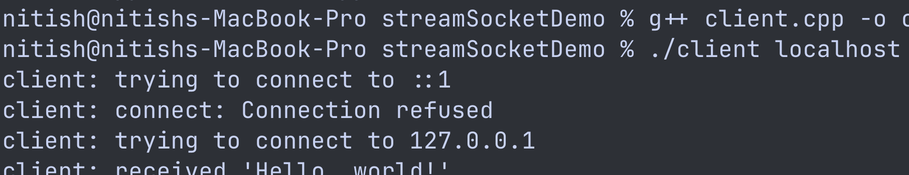

# Stream Socket Demo (C++)

A simple **TCP client–server implementation in C++** inspired by *Beej's Guide to Network Programming*.
This project demonstrates how a TCP server accepts incoming connections and sends a message to a client using **POSIX sockets**.

The goal of this project is to understand the fundamentals of **network programming**, including sockets, TCP communication, and client–server architecture.

---

## Features

* TCP server listening on port **3490**
* Client connects using hostname or IP address
* IPv4 / IPv6 support via `getaddrinfo()`
* Demonstrates the full socket workflow:

```
Server
socket() → bind() → listen() → accept() → send()

Client
socket() → connect() → recv()
```

---

## Project Structure

```
streamSocketDemo
│
├── server.cpp
├── client.cpp
├── client
├── README.md
└── screenshots
    ├── waiting_for_connections.png
    ├── got_connections.png
    └── client_connected.png
```

---

## Requirements

* Linux / macOS
* C++ compiler (`g++`)
* POSIX socket support

---

## Compilation

Compile both the server and client using `g++`.

```
g++ server.cpp -o server
g++ client.cpp -o client
```

---

## Running the Program

### 1. Start the Server

```
./server
```

Output:

```
server: waiting for connections...
```

---

### 2. Run the Client

Open another terminal and run:

```
./client localhost
```

Example output:

```
client: trying to connect to 127.0.0.1
client: received 'Hello, world!'
```

---

## Screenshots

### Server Waiting for Connections



---

### Server Got a Connection



---

### Client Connected to Server



---

## Concepts Demonstrated

* TCP socket programming
* Client–server communication
* Address resolution with `getaddrinfo`
* IPv4 / IPv6 compatibility
* Sending and receiving data over sockets

---

## Reference

This project is based on concepts from:

**Beej's Guide to Network Programming**
https://beej.us/guide/bgnet/

---

## License

This project is for **educational purposes** and can be freely used or modified.
