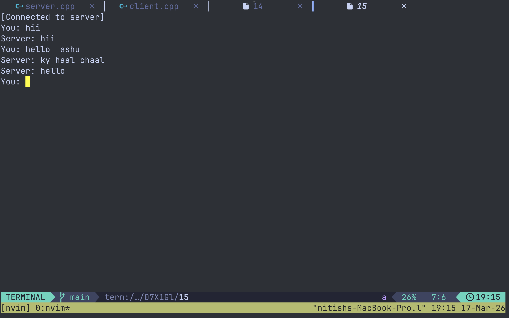
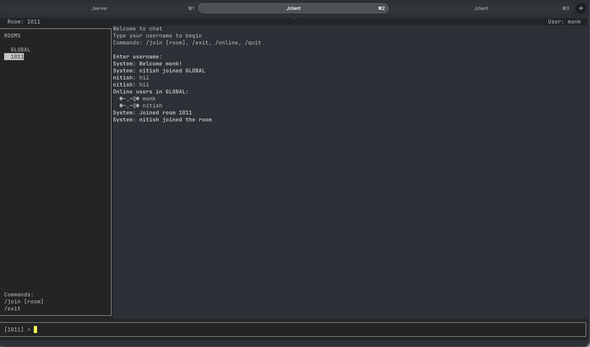
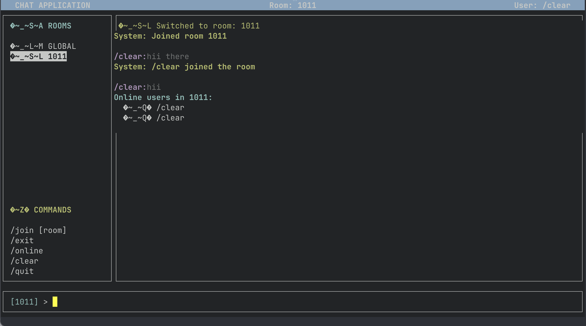
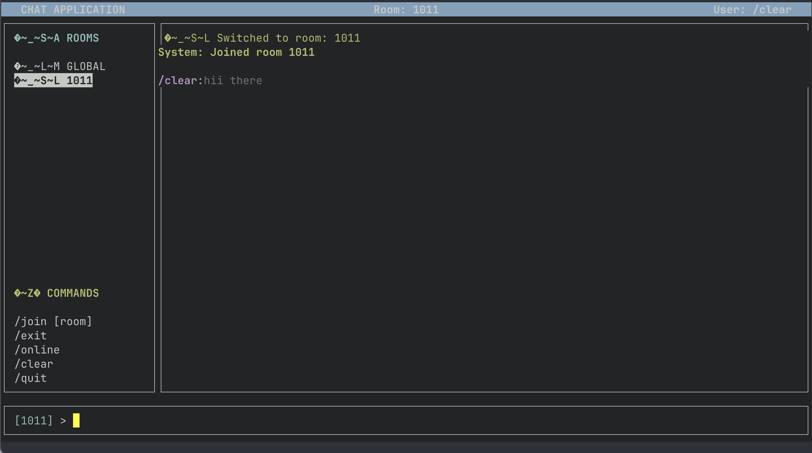
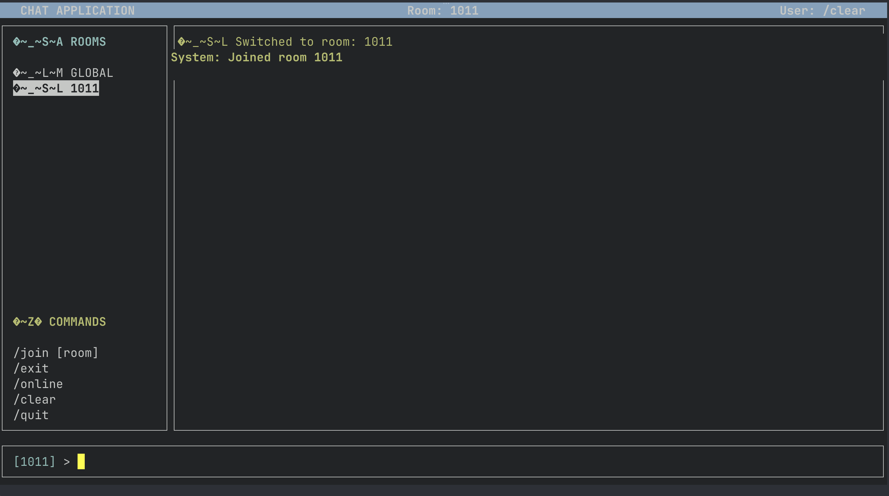

# 💬 TermChat

A terminal-based multi-user chat application built in **C++** using **TCP sockets** and **ncurses**. It supports real-time messaging, multiple rooms, and a clean TUI interface.

---

## ✨ Features

* 🎨 Minimal & clean TUI (ncurses)
* 💬 Multi-room chat (`/join`, `/exit`)
* 👤 Mentions (`@username`)
* 📋 Online users list (`/online`)
* ⚡ Real-time messaging (poll-based server)
* 🔔 System notifications

---

## 📸 Screenshots

<p align="center">
  <br><br>
  <br><br>
  <br><br>
  <br><br>
  
</p>

---

## 🛠️ Tech Stack

* **C++17**
* **ncurses**
* **TCP sockets**
* **poll()**
* **pthread**

---

## ⚙️ Setup

### Install dependencies

**Ubuntu/Debian**

```bash id="8v3e9z"
sudo apt install g++ libncurses5-dev
```

**macOS**

```bash id="2u4h4f"
brew install ncurses
```

---

### Compile

```bash id="g6qqkt"
g++ server.cpp -o server -pthread
g++ client.cpp -o client -lncurses -pthread
```

---

### Run

Start server:

```bash id="pjvndy"
./server
```

Run client(s):

```bash id="4k9t0b"
./client
```

---

## 🎮 Commands

| Command      | Description      |
| ------------ | ---------------- |
| `/join room` | Join/create room |
| `/exit`      | Back to GLOBAL   |
| `/online`    | List users       |
| `/clear`     | Clear chat       |
| `/quit`      | Exit             |

---

## 🧠 How it Works

```text
Client → TCP → Server → Room Filter → Clients
```

Each user is mapped as:

```text
fd → username + room
```

Messages are delivered only within the same room.

---

## ⚠️ Limitations

* No message persistence
* No encryption
* Basic TCP (no message framing)

---

## 🚀 Future Improvements

* Private messaging
* Message timestamps
* Better input handling
* WebSocket version

---

## 👨‍💻 Author

**Nitish**

---

## ⭐ Note

This project demonstrates **low-level networking + terminal UI design**.

If you understand this, you're already ahead of most beginners.

---
